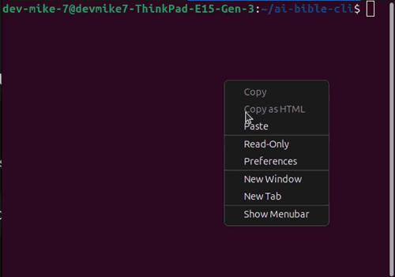

  

  
  
  
  
  

  A command-line assistant that answers questions with clear explanations and real Scripture references. 
  Uses a local Bible file for verse lookup + OpenAI for concise explanations.

---

## ✨ Features
- 🔎 **Local verse search** (fast, offline-friendly)
- 🧠 **AI explanations** with cited verses
- 🧰 **Simple CLI** (`node bible-ai.js`)
- 🧩 Pluggable data source (`bible.json` – tiny sample or full KJV)
- 🛡️ No secrets committed (.env ignored)

## 📸 Demo

  

## 💼 Commercial Licensing
If you would like to use AI Bible CLI for any commercial purpose — such as hosting it online, selling access, or integrating it into a paid app or service —  
please contact **Michael Shants** at [shants.tech@gmail.com] to obtain a commercial license or partnership agreement.

